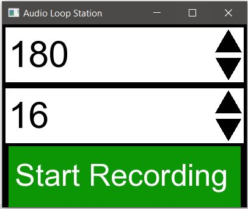

# Digital Audio Loop Station

Created for my senior design project, this app brings the audio looper device into a digital application. The user can record, edit and playback an arbitrary number of loops. There are two user interfaces, which I will walk through.

### Opening User Interface

When launching the application, you will be greeted with the opening UI, shown below. This UI is used to set up two main variables: the Beats Per Minute (BPM) and length of a loop (in beats) for your audio looping project. You will see these two values displayed, as well as arrows to their right. These arrows will increase and decrease each of these values. Once you have these two values set up, you can click the “Start Recording” button to move into the main UI of the application.

### Main User Interface

Shown above is the main application UI. Beginning from the bottom, these are the UI controls:

Audio Playback Controls
- “Record” button: Use this to record a new audio loop. The length of a recording will be
determined by the variables set up in the opening screen. Recorded audio will be saved
in the “/sounds” folder.
- “Play” button: begin playing all audio loops. This will be used when the user pauses or
stops playback
- “Pause” button: Pauses audio playback. Upon pressing Play again, it will resume playing
from where it paused
- “Stop” button: Stops music playback. This is similar to Pause, except playback will start
from the beginning when Play is pressed again
Loading Files
- Input textbox: Clicking on this box allows the user to type in a filename to load for
playback. Note it will only load music in the “/sounds” folder.
- “Load” button: Pressing this will load the file under the name entered in the textbox. If no
such file exists, the textbox will highlight red. Altering Pitch and Tempo
- Pitch Slider: changing the position of the black square will turn the pitch up or down on the previously loaded or recorded audio loop. The minimum value is 0.5x the original, while the maximum is 2x the original.
- Tempo Slider: changing the position of the black square will increase or decrease the playback speed of the previously loaded or recorded audio loop. The minimum value is 0.5x the original, while the maximum is 2x the original.
Reverse and Undo Features
- “Reverse” button: This will reverse playback of the previously loaded or recorded audio
loop.
- “Undo” button: This will remove the previously loaded or recorded audio loop. Pressing
undo more than once will continue to undo audio loops until there are none. Top Information Box
- There are no controls here, but it does provide information on the BPM and loop length, set up in the initial interface.

### Source code
The source code can be foud [here](https://github.com/mitchbr/AudioLoopStation/tree/main/SfmlAudioLoopStation)

A video showing my demonstration of the project can be seen here:

### [Return to the Homepage](index.md)
