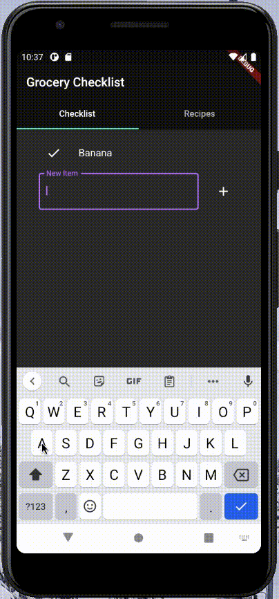

# Grocery List App

This app's purpose is to provide a means for creating a convenient place to create a grocery checklist not only for individual items, but or recipes as well. This app includes a page for saving recipes which can be added to the grocery checklist, a great way to quickly come up with ideas for cooking dinner. 

### The Checklist

The main page of the app is a simple checklist used for grocery shopping. It allows users to add items and check them off as they are placed in the cart. The GIF below shows the main functionality of the checklist, adding an item and chaking it off. Individual items can be added, as well as full recipes, shown in the next section.

### The Recipes Page

The recipes page is used for storing favorite recipes in a central location, where they can easily be added to the checklist. First, you can see the functionality for creating a recipe; the user names the recipe then adds items used in the recipe. Once the recipe has been saved, it can be previewed on the recipes page. In this preview, the used can check and uncheck items in the recipe. When the user clicks 'save,' all checked items will be sent to the main checklist to be picked up at the store.

)

### Future plans

Some items I would like to add to the app to improve its functionality:

 - Keep checklist items after marked; move them to the bottom and draw line through them
 - Get ReorderableListView working. Currently does has the option to drag and drop, but list does not update properly
 - Add amounts for each item, allowing the user to remember how much of something they want (ie 2 apples)
 - Integrate the Recipe API to let the user explore fun recipes published by others
 - Add estimated price and/or coupons for items

### Source Code
The source code can be found [here](https://github.com/mitchbr/mitchbr/tree/master/Grocery%20List%20App)

### [Return to the Homepage](index.md)
