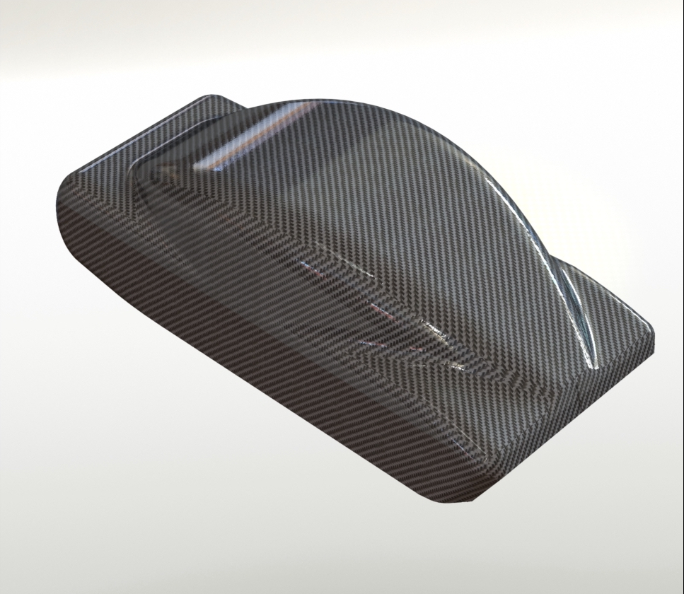
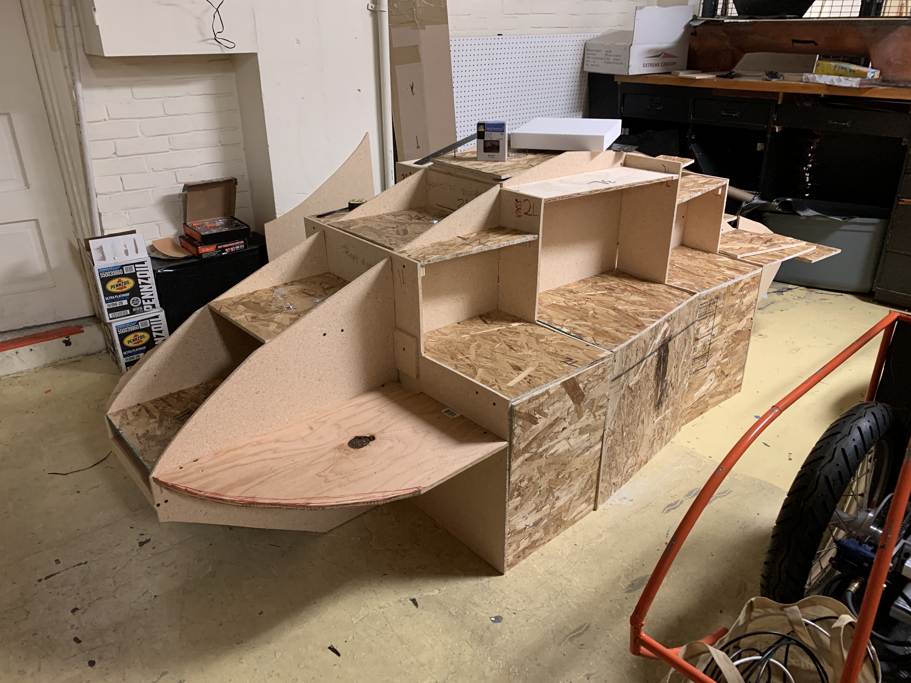
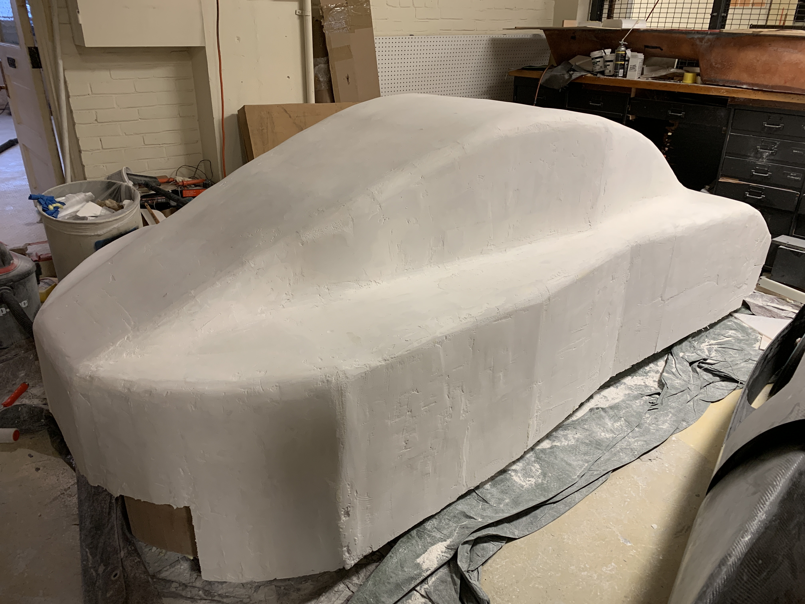
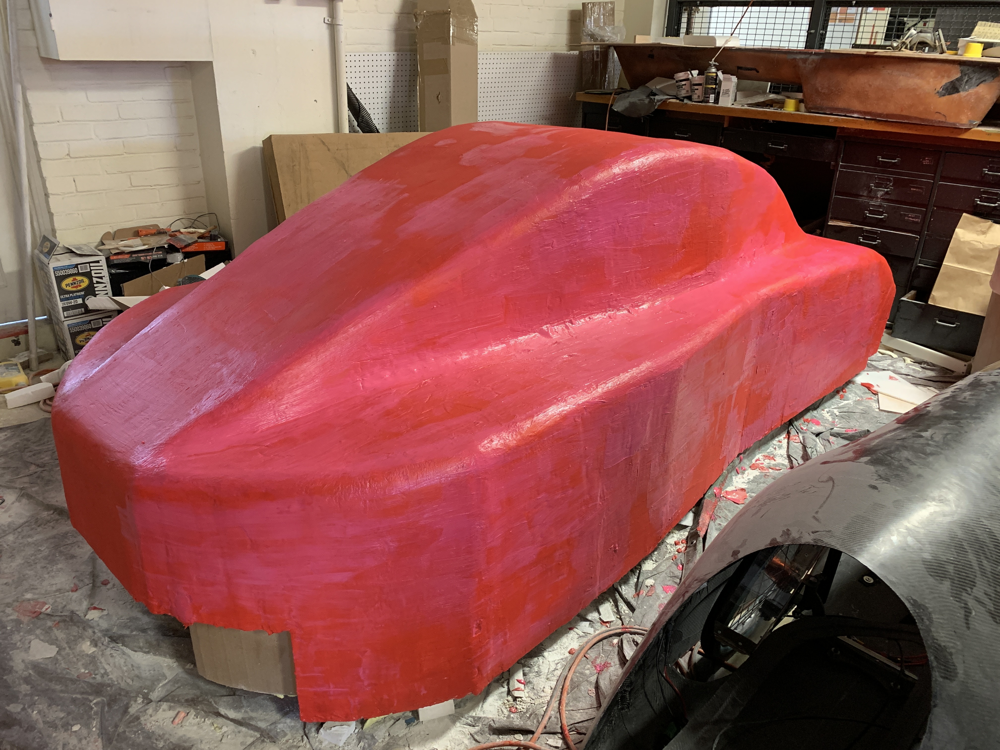

## Mechanical Engineering Senior Design Project

For my senior design project, I was tasked with designing a carbon fiber shell for the Shell Ecomarathon team at Oregon State University (OSU). To begin, we evaluated the current car our shell would go on, and began designing the body. Due to the onset of Covid and time constraints, we were only able to get the plug to a final state. For reference, the plug is the positive shape that represents what the final product will look like. From the plug, a mold can be laid, which is then used for layup of the final carbon body.

## Images from the Build Process
### CAD Model
This is our computer model used to design the shape of the carbon fiber shell. We used the dimensions of the car for reference, and constrained it using the Shell Ecomarathon ruleset.

### Wood Frame
The wood frame was used to create the basic shape of the plug as well as add guides for shaping foam later.

### Final Shape
Using a shaping foam, expanding foam, and drywall spackle, we were able to create a smooth finish which would be used to lay up a fiberglass mold.

### Red Guard Protection
Red Guard was used prior to adding fiberglass as it would prevent the epoxy from soacking into the foam and possibly ruining some of it.

# Final Report
For more imformation on the senior design project, here is the final report submitted by myself and my team.

[View the Final Design Report](https://github.com/mitchbr/mitchbr/blob/master/Non%20Software%20Projects/Senior%20Design/Final%20Report.pdf)

### [Return to the Homepage](index.md)
