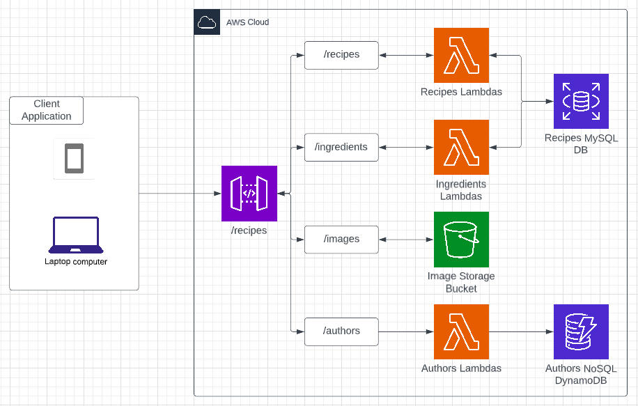
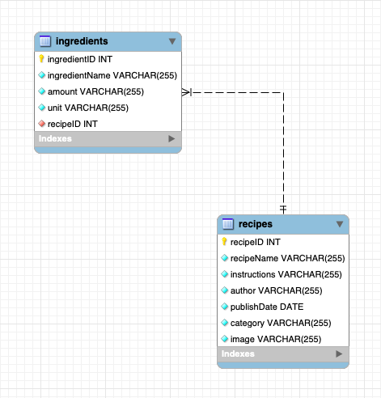

# Recipe AWS API

This API was developed both to learn AWS skills, as well as to integrate with the Grocery List App in the future. Utilizing RESTful principles, this API uses HTTP requests to retrieve and upload user's recipes

### API Structure

#### Endpoints

The endpoints are as follows:

)

As you can see, there are four primary groups: recipes, images, ingredients, and authors. Recipes endpoints are for interacting with recipe metadata such as recipe name, author, and instructions. Images endpoints allow images related to those recipes to be stored and retrieved. Authors allows new users to be added, and for users to 'follow' one another. This will eventually allow users to follow each others recipes as they post them.

For now, ingredients only has a GET endpoint, I am currently deciding how to go about adding/updating/deleting ingredients. The GET endpoint was split off to save latency when downloading a lot of recipes, as ingredients aren't always needed at the same time. As it stands, you only need to make one call to add/update/delete both recipes and ingredients. I could split these functionalities, and it would greatly simplify the recipes endpoints, but would mean a second endpoint would need to be called in my apps. AWS eventbridge could be an option to somewhat split up these processes while using one endpoint, and would move towards a microservice architecute, but this is yet to be decided.

#### AWS Services

As seen in this diagram, both the recipes and ingredients endpoints call AWS Relational Database Service (RDS). I chose this service so I could use a MySQL database, and allow my to flex many SQL capabilities. For example, I plan to be able to 'Filter' and 'Sort' by data in my apps in the future. In addition to this, I would like to be able to find 'similar recipes' by using the ingredients table.

The images endpoints go straight to S3. I did this to simplify implementation of image storage, and I have found S3 to be the best method for storing large amounts of data in formats like images.

The authors endpoints are using NoSQL with DynamoDB. I chose this because I will always be retrieving users by their username, which is perfect for NoSQL's key-value pair storage methods.

#### MySQL Schema

Currently, the database has two tables, recipes and ingredients. As the names suggest, recipes gives primarily metadata for a recipe, such as the name and author. The ingredients table stores ingredients related to those recipes. The schema can be seen below:

### Trying the API
There is a [Postman Collection](https://web.postman.co/workspace/My-Workspace~4d525aab-f050-462c-8b0f-26a21dae4de1/collection/21203434-f5892415-d1dc-4585-b828-b9ceb60b9297) for this API which allows you to view the various endpoints, and try them out for yourself.
  
There is also a Flutter application which I am using as a test area before integrating this API with the Grocery Tracker app. The [Android Build](https://github.com/mitchbr/RecipeApi/tree/main/Flutter%20Builds/Android) is available for download if you would like to try it yourself.
  
### Source Code
The source code for each API call can be found [here](https://github.com/mitchbr/mitchbr/blob/master/RecipeApi/lambda_function.py)
  
### [Return to the Homepage](index.md)
