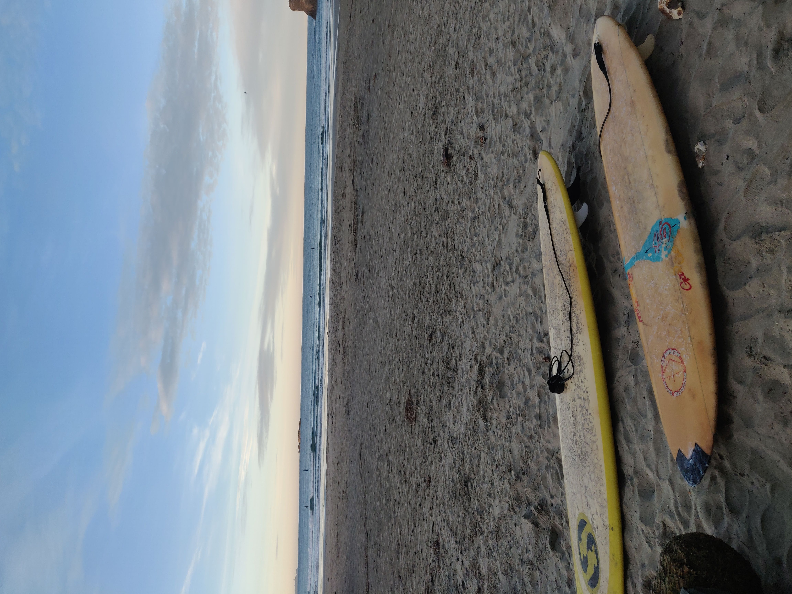
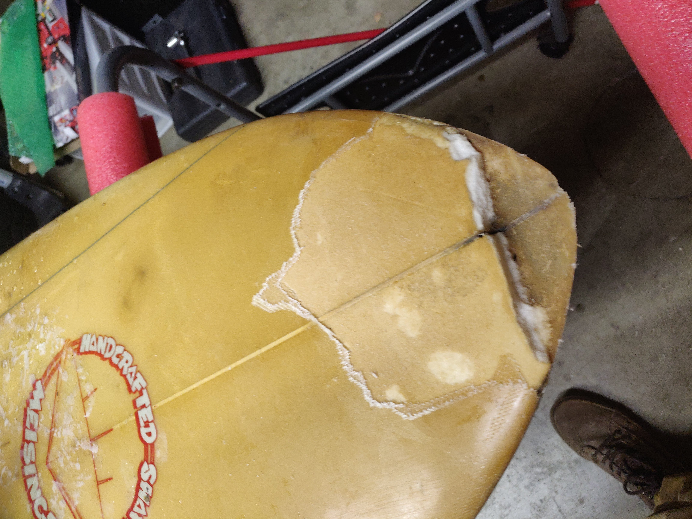
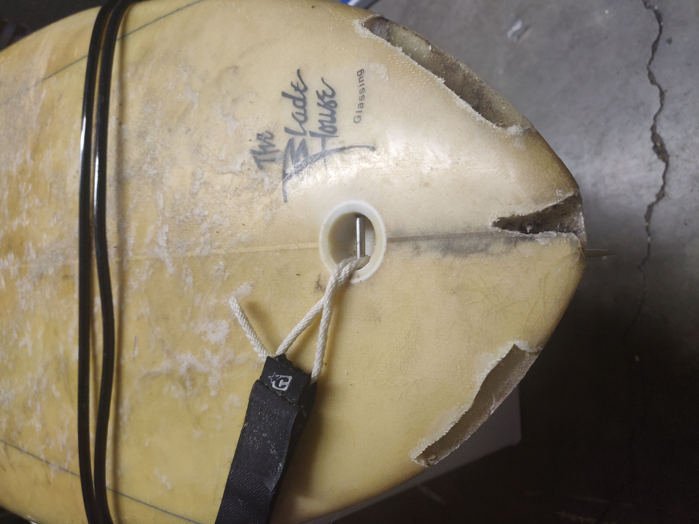
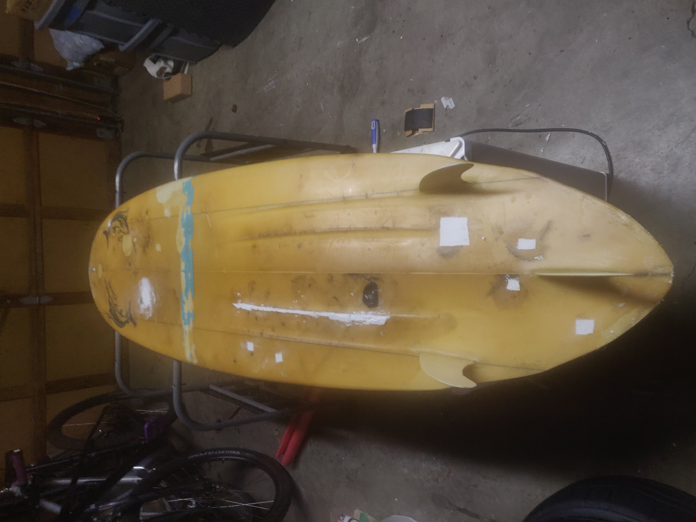
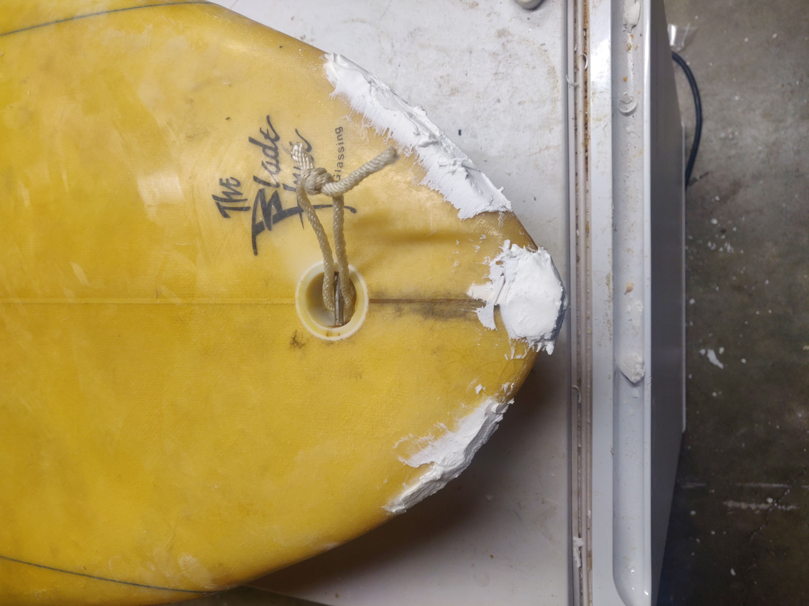
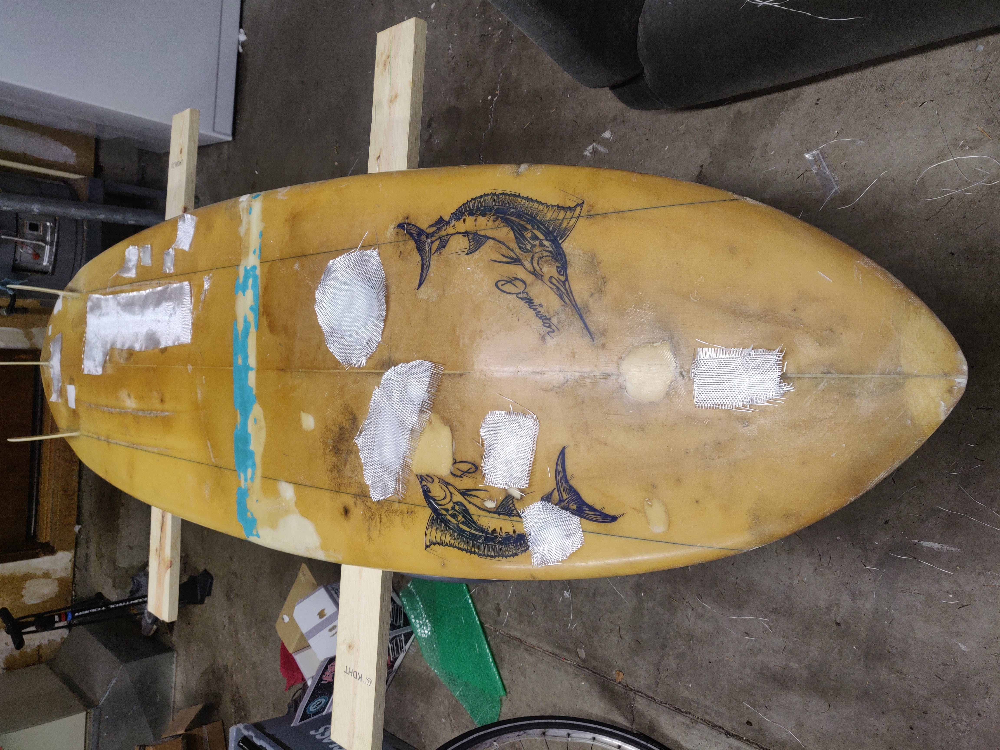
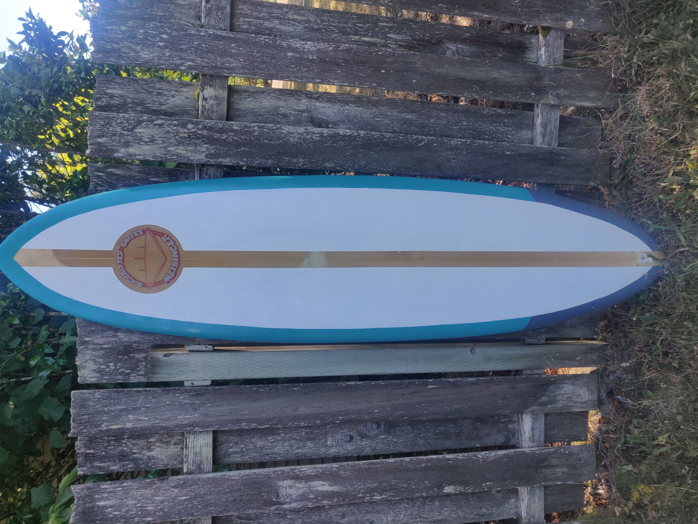

## Surfboard Restoration
While I have no plans of using the composites knowledge I learned from my mechanical engineering senior project, it has proven to be invaluable to one of my favorite hobbies. Old surfboards can be found for great bargains around Oregon, they just need some love.

### Restoring the Meisenger

My first surfboard was just one of those, a $75, sun-baked board that had likely come from a garage cleanout. First, you can see the condition the board was in when I received it. Initially, I had to do a lot of research to determine what areas needed to be fully torn down and restored, and a few are highlighted. Areas of cracked fiberglass, rotten foam, or holes through the fiberglass, needed to be removed.

To fill in these holes, it is common to use what is known as Q-cell with an epoxy resin. This is a strong, non-water absorbing material that is easy to sand. However, it can be expensive and hard to find in small quantities like I need. Instead, I used drywall spackle to fill in any holes formed from cutting away bad material. Drywall spackle isn't exactly the most ideal material to use, as it would be much weaker than Q-cell, but it does hold a few key properties, as it is:
 - Buoyant and doesn't abosrb water
 - Very light (minimizing added weight)
 - Easy to sand and shape
 - Extremely cheap and easy to find

Finally, fiberglass was applied to the board to add strength and ensure it is water tight. This is one of the areas where I was not only able to use skills I had learned in my senior design, but iterate and improve on the processes used to lay the glass.

Finally, the completed board is shown here

### [Return to the Homepage](index.md)
